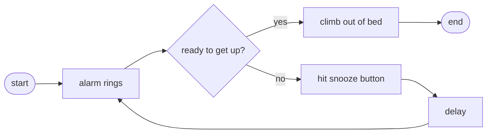

#### How to make scrambled eggs

- Pour oil ino skillet.
- Heat oil.
- Break the egg and pour into hot oil.
- Fry it.
- Serve on a plate.

---

#### Flow chart



---

#### Psuedocode

```pseudocode
DECLARE
  A,B,C: Integer

ALGORITHM
  A = 1;
  B = 2;
  C = A + B;
```
