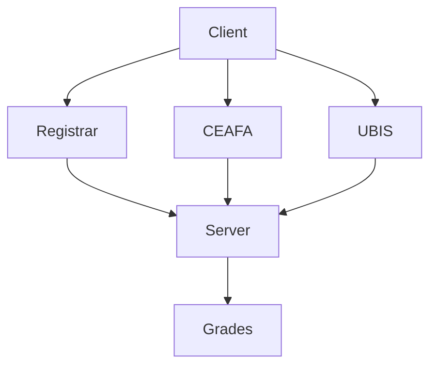

- **Program** is an implementation of an **algorithm** that was made from one programming languages.
  - Hybrid Platform
    - Online / Web
    - Desktop
    - Mobile
- **Programming Language** is a notation ha was used in algorithm notation to communicate with computer.
- Programmers are people who made the programs with one or many programming language.

