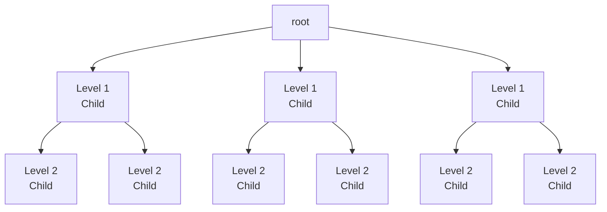
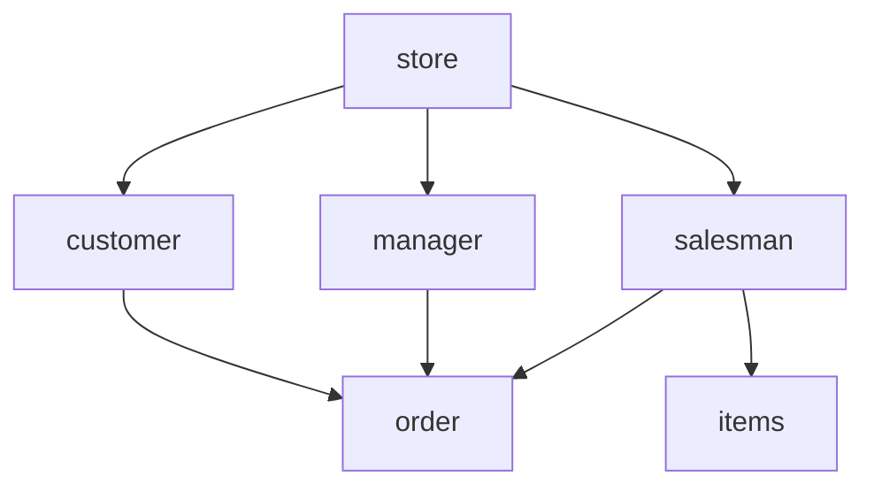
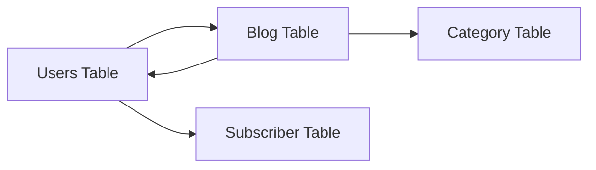

# Introduction to Database

## What is Database?

- A **Database** is a collection of organized data, information, an records

## Purpose of Database

- Database is information that a person need in his personal business, social and religious life and he power and purpose of information is no only in collecing and finding them but more importantly in **using them**.

## Kinds of Database

### Structured Database

- Is also called the **structured data** in which a record or file of information arranged in uniform format.
- These databases are usually storage of information with similar entries **such as** a list of persons born in a country, a medical database of patients' data, an inventory database of a company and many others.

### Free-form Database

- It is a **loose collection** of information, such as those you will find on the World Wide Web.
- A collection of your documents in the computer made from several programs can be considered as free-from database.

### Operational Database

- Is a dynamic database that is used by any organization in its day-to-day operation.
- They are used to collect data, maintain, modify and delete data.

### Analytical Database

- Is a static database, where data is ~~rarely~~ not modified.
- This database is often used to store an track historical data to make long term projections and analysis.

---

## Structure Database Model

### Heirarchical Model

This model can be visualized as parent-child relationship wherein a child may only have one parent but a parent can have several other children.

Another way of looking at this model is by visualizing an inverted tree. The single table acts as the root of the inverted tree and the other tabes act as branches.

To access the data from one of the tables, one has to pass through the root table. This model was popular in the many IBM Information Management Systems in the 1970s using mainframe computer.

### Network Model

This model was developed to address in part the problems of the hierarchical model. As with heirarchical model, it could be visualized as an inverted tree; However, this model allows many inverted trees sharing branches but are still part of the same database structure.

As with the parent-child model, the child is allowed to have multiple parents. Unlike in the hierarchical model, access data begins from the root table.

In the network model, it allows access of data from any table. This model was eventually replaced by the relational database model.

### Relational Model

Was developed by Dr. E.F. Codd of IBM in the 1970s partly to solve the problems of the earlier database models as well as finding of making database management less dependent on any application.

The terms relations, attributes and domains are used frequently in relational database models.

A relation is a table with columns and rows.

Attributes are the names given to each column of the relation. Domain is the value with which the attributes will take.

A relational database is essentially a collection of tables, and if a database is a collection of tables, these tables are simply called relations, hence, the name.

