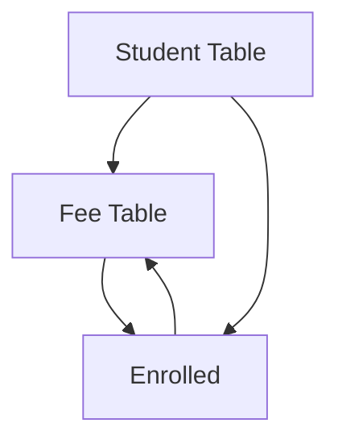

# Information Systems

![[cc105.prelim.information systems]]

---

# System Analysis and Design

![[cc105.prelim.systems-analysis-and-design]]

---

# Design, Develop, Manage and Use

- Information with **insight** and **innovation**

## Support Decision

## Databases

![[cc105.prelim.databases]]

---

### DBMAS

- Holds all the information
- Recess and Records
- Collection of interrelateed and persistent data
- set of application program used to access, delete and manage data

#### Example:

## Why use DBMS

- independent and efficient data
- reduced application development
- data integrity and security
- uniform data administration
